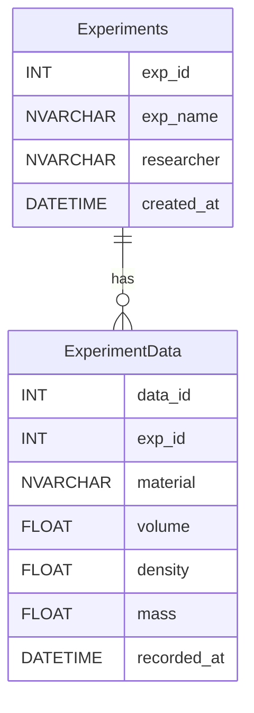

# sql_agent.py Structure

## Purpose
- SQL agent for Azure OpenAI + MSSQL with custom tools for lab experiments and fall detection queries.

## Top-level layout
1. Imports
2. Logging setup
3. Global state
4. Environment and DB helpers
5. Schema initialization
6. Tool functions
7. Agent creation (prompt, few-shot, tools)
8. main() CLI loop
9. LLM factory
10. Entry point

## Globals
- logger: module logger
- db_engine: shared SQLAlchemy engine for tool functions

## Functions
### load_environment()
- Loads `azure_and_sql.env`
- Validates required environment variables

### get_connection_string()
- Builds ODBC 18 `mssql+pyodbc` URL from env vars

### init_db_schema(engine)
- Creates `Experiments` table if missing
- Drops and recreates `ExperimentData` to enforce schema
- Commits changes

### create_experiment(exp_name, researcher="Assistant") [tool]
- Inserts a new experiment in `Experiments`
- Uses the global `db_engine`

### log_experiment_data(exp_name, material, volume, density, mass=None) [tool]
- Inserts a measurement into `ExperimentData` via `exp_name` lookup
- Returns an error message if the experiment does not exist

### create_conversational_agent(llm, db)
- Defines few-shot examples for two domains
- Builds a `FewShotPromptTemplate` with a system prefix
- Creates a LangChain SQL agent with extra tools

### main()
- Loads environment
- Optionally enables Azure Monitor tracing if a connection string exists
- Creates SQLAlchemy engine and initializes schema
- Creates SQLDatabase and AzureChatOpenAI LLM
- Builds agent and starts REPL loop for user input

### get_azure_openai_llm()
- Returns `AzureChatOpenAI` configured from env vars

## Data model (MSSQL)
- Experiments(exp_id, exp_name, researcher, created_at)
- ExperimentData(data_id, exp_id, material, volume, density, mass, recorded_at)

## Agent domains and rules (from system prefix)
- Domain 1: Cylinder stability (fall detection) using `CylinderLogs`
- Domain 2: Lab experiments (master-detail) using `Experiments` + `ExperimentData`
- Rule: use tool functions for writes; use joins for read queries
- Rule: respond in Korean unless requested otherwise

## High-level control flow
main()
- load_environment()
- get_connection_string() -> create_engine()
- init_db_schema(engine)
- SQLDatabase(engine)
- get_azure_openai_llm()
- create_conversational_agent(llm, db)
- REPL loop -> agent_executor.invoke()

## External dependencies
- dotenv
- langchain_openai
- langchain_community
- langchain_core
- sqlalchemy
- azure.monitor.opentelemetry
- opentelemetry.instrumentation.langchain

---

# sql_agent.py 구조 (한국어)

## 목적
- Azure OpenAI + MSSQL 기반 SQL 에이전트이며, 실험 기록 도구와 전도(넘어짐) 탐지 질의를 지원합니다.

## 전체 구성
1. Imports
2. 로깅 설정
3. 전역 상태
4. 환경 변수/DB 헬퍼
5. 스키마 초기화
6. 도구 함수
7. 에이전트 생성(프롬프트, few-shot, 도구)
8. main() CLI 루프
9. LLM 팩토리
10. 엔트리 포인트

## 전역 변수
- logger: 모듈 로거
- db_engine: 도구 함수에서 공유하는 SQLAlchemy 엔진

## 함수별 요약
### load_environment()
- `azure_and_sql.env` 로드
- 필수 환경 변수 검증

### get_connection_string()
- env 값으로 ODBC 18 `mssql+pyodbc` URL 생성

### init_db_schema(engine)
- `Experiments` 테이블이 없으면 생성
- `ExperimentData` 테이블은 스키마 보장을 위해 드롭 후 재생성
- 커밋 수행

### create_experiment(exp_name, researcher="Assistant") [tool]
- `Experiments`에 새 실험 세션 삽입
- 전역 `db_engine` 사용

### log_experiment_data(exp_name, material, volume, density, mass=None) [tool]
- `exp_name` 기반으로 `ExperimentData`에 측정값 삽입
- 실험명이 없으면 오류 메시지 반환

### create_conversational_agent(llm, db)
- 두 도메인(fall detection, lab experiments) 예시 정의
- `FewShotPromptTemplate` + 시스템 프리픽스 구성
- 커스텀 도구 포함한 LangChain SQL 에이전트 생성

### main()
- 환경 변수 로드
- Application Insights 연결 문자열이 있으면 Azure Monitor 트레이싱 활성화
- SQLAlchemy 엔진 생성 및 스키마 초기화
- SQLDatabase + AzureChatOpenAI 생성
- 에이전트 생성 후 REPL 루프 시작

### get_azure_openai_llm()
- env 기반 `AzureChatOpenAI` 반환

## 데이터 모델 (MSSQL)
- Experiments(exp_id, exp_name, researcher, created_at)
- ExperimentData(data_id, exp_id, material, volume, density, mass, recorded_at)

## 에이전트 도메인과 규칙
- 도메인 1: Cylinder stability (fall detection) -> `CylinderLogs`
- 도메인 2: Lab experiments (master-detail) -> `Experiments` + `ExperimentData`
- 쓰기(INSERT)는 반드시 도구 함수 사용
- 읽기는 JOIN 사용
- 기본 응답 언어는 한국어

## 실행 흐름 요약
main()
- load_environment()
- get_connection_string() -> create_engine()
- init_db_schema(engine)
- SQLDatabase(engine)
- get_azure_openai_llm()
- create_conversational_agent(llm, db)
- REPL loop -> agent_executor.invoke()

## 다이어그램
```mermaid
flowchart TD
  A[main()] --> B[load_environment]
  B --> C[get_connection_string]
  C --> D[create_engine]
  D --> E[init_db_schema]
  E --> F[SQLDatabase]
  F --> G[get_azure_openai_llm]
  G --> H[create_conversational_agent]
  H --> I[REPL loop]
  I --> J[agent_executor.invoke]
  J --> I
```



## 외부 의존성
- dotenv
- langchain_openai
- langchain_community
- langchain_core
- sqlalchemy
- azure.monitor.opentelemetry
- opentelemetry.instrumentation.langchain
